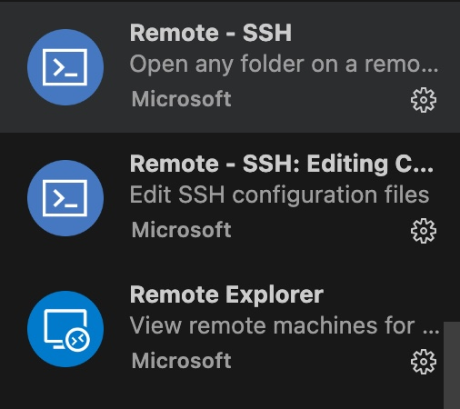

# 📘: SSH-Connect-servers 📘:
如何通过SSH远程连接服务器
### **1 从vscode上下载Remote-SSH插件**

### **2 配置服务器文件**

点击vscode左下角的按钮

  

### **3 点击后顶部下拉菜单中点击连接到主机**

  

### **4 配置config文件**

config文件的默认路径为/users/ldr/.ssh/config

  

